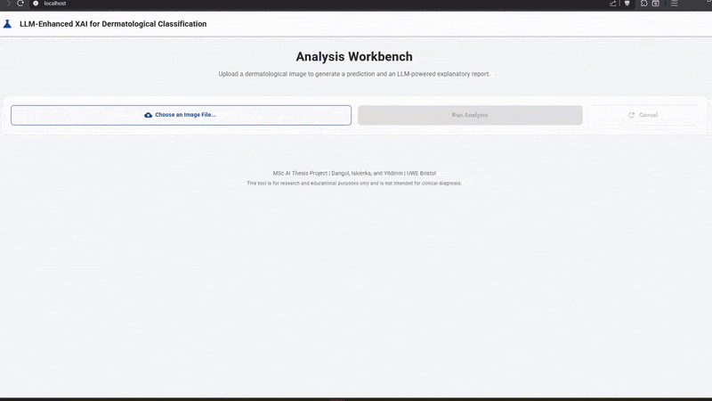
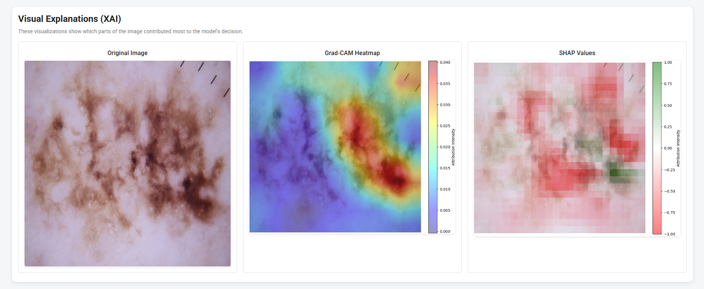
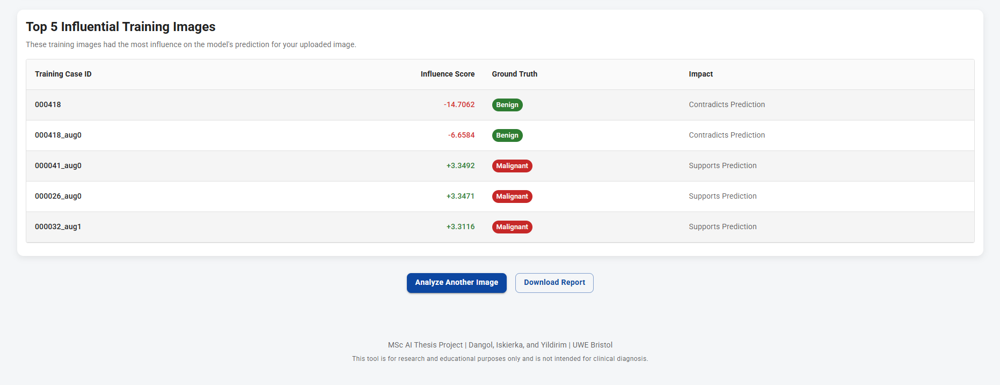

# MSc AI LAB - LLM-Enhanced Interpretability of XAI for Dermatological Cancer Classification 🎓🤖

Welcome to the **Skin Cancer Detection with LLM-enhanced Explainable AI** repository! This project was a part of our Master's research in **Artificial Intelligence** at UWE Bristol.

## Project Overview

The project explores LLM-powered, human-centric Explainable AI (XAI) for skin cancer classification — bridging the gap between technical model explanations and real-world clinical understanding. We developed an AI-driven dermatological screening system that classifies benign vs. malignant skin lesions using a ResNet34-based CNN enhanced with Low-Rank Adaptation (LoRA) and a spatial attention mechanism for improved diagnostic focus.

To make AI reasoning transparent and accessible, the system integrates multiple XAI techniques — Grad-CAM, SHAP, and Influence Functions — and translates their outputs into natural language explanations using a Large Language Model (LLM). This approach enables dermatologists and non-technical users to understand the model’s confidence, reasoning, and influencing factors behind each diagnosis.



## Key Features

1. **Intelligent Skin Cancer Classifier**  
We chose pre-trained ResNet34 CNN which was then enhanced with LoRA and attention mechanisms for accurate and focused lesion classification.

2. **Multi-Layer Explainability Framework**  
We combined Grad-CAM (visual attention), SHAP (feature importance), and Influence Functions (case-level interpretability) for mult-perspective insights into AI decission-making process.

3. **LLM-Powered Explanations**  
LLM pipeline employing GPT-4.1 and meticulous prompt engineering converts complex XAI outputs into structured, human-readable reports for non-AI experts, such as clinicians.

4. **Quantitative & Qualitative Validation**  
We achieved 100% LLM interpretation accuracy on 3 key metrics and our survey confirmed high user preference for LLM-enriched explanations (p < 0.05).

5. **Containerised Deployment**  
Full Docker setup for reproducible, cross-platform deployment (Docker deployment instructions further down below).

6. **Human-Centric Design**  
We built the system to promote transparency, accessibility, and trust in AI-assisted dermatological diagnostics.

## Demonstration  

Our container-run application allows for analysis of user-selected samples. Below is an example output for a skin sample with confirmed diagnosis of malignancy: 





Here is a closer look at the LLM-generated report. It offers natural language explanations to bridge the gap between non-intuitive technical XAI outputs and non-AI-expert users:

```text
**Summary**

The AI analysis suggests moderately high concern for malignancy in this skin lesion.

**Confidence Level**

The model is 79.57% confident, meaning there's still a 20.43% chance this assessment could be incorrect.

**Key Findings**

- *Grad-CAM:* The heatmap shows strong red and orange areas mainly in the central and lower right portions of the image, indicating these regions were most important for the model's "Malignant" prediction.

- *SHAP:* The analysis shows that green features, which support the "Malignant" prediction, are scattered in the lower right and central areas, but most of the image is covered by red features, which actually push against the "Malignant" prediction and support "Benign" instead. The green areas are less concentrated and less intense than the red areas.

- *Grad-CAM and SHAP alignment:* The main focus areas for Grad-CAM and SHAP do not fully overlap. Grad-CAM highlights the central and lower right regions as most important, while SHAP shows a mix of green and red in these areas, with red (supporting "Benign") being more dominant overall.

- *Influence Function:* 65% of the most influential training cases were diagnosed as "Malignant", while 35% were diagnosed as "Benign". Notably, 11% of these influential training samples were originally misclassified during training, which raises concerns about the reliability of the model's reasoning foundation.

**What This Means**

Given the moderately high model confidence (79.57%), the lack of clear agreement between Grad-CAM and SHAP focus areas, and the fact that only 65% of influential training cases were "Malignant" with a notable 11% misclassification rate, this AI analysis should be interpreted with caution. Careful human review is strongly recommended to validate the AI's assessment before any clinical decisions are made.

**Important Limitations**

This AI analysis is designed to assist healthcare decisions, not replace professional medical evaluation. A dermatologist can provide a definitive diagnosis through clinical examination and, if needed, biopsy.
```

---

## 📂 Repository Structure
```text
Skin-Cancer-Detection-with-LLM-enhanced-Explainable-AI/
│
├── backend/Dockerfile          # Python + ML stack
├── frontend/Dockerfile         # Node.js build + Nginx
├── frontend/nginx.conf         # SPA routing config
├── data/                       # Contains raw and processed datasets.
├── models/                     # Stores final trained model artifacts (.pth files).
├── notebooks/                  # Jupyter Notebooks for the project workflow.
├── results/                    # Destination for outputs like XAI images and reports.
├── user_inputs/                # For placing sample images for XAI analysis.
├── .gitignore                  # Specifies files for Git to ignore.
├── README.md                   # Project documentation (this file).
├── requirements.txt            # Project dependencies.
├── docker-compose.yml          # Service orchestration
└── requirements-docker.txt     # Clean Python deps (no git)

```

# 🐳 Docker Deployment Guide

For the quickest setup we recommend running the application in a Docker container. This containerised deployment is using Docker Compose with separate frontend and backend services.

## 📋 Prerequisites

- **Docker Desktop** 4.0+ with Docker Compose
- **8GB+ RAM** and **10GB+ disk space**

## 🏗️ Architecture Overview

| Service | Technology | Size | Port | Purpose |
|---------|------------|------|------|---------|
| **Backend** | FastAPI + PyTorch | ~2.47 GB | 8000 | AI inference, XAI, LLM reports |
| **Frontend** | React + Nginx | ~50 MB | 80 | Professional medical UI |

## 🚀 Quick Start

```bash
# Clone and navigate
cd Skin-Cancer-Detection-with-LLM-enhanced-Explainable-AI

# Build and start all services
docker compose up --build

# Access applications
# Frontend: http://localhost
# API Docs: http://localhost:8000/docs
# Health Check: http://localhost:8000
```

## 📊 Expected Build Process

**Build Time:** ~2-3 minutes total
- Backend: ~84s (includes PyTorch + ML dependencies)
- Frontend: ~32s (React build + Nginx setup)

**Startup Logs to Expect:**
```bash
✔ Service backend   Built                84.1s 
✔ Service frontend  Built                32.5s 
```

**Runtime Initialization:**
```bash
# Backend model download
Downloading: "resnet34-b627a593.pth"
100%|██████████| 83.3M/83.3M [00:02<00:00, 29.9MB/s]
INFO: Uvicorn running on http://0.0.0.0:8000
INFO: Application startup complete.

# Frontend ready
nginx/1.28.0 ready for start up
```

## 🔍 Verification & Testing

### Docker Desktop Status
- **Containers**: Both services showing 🟢 green status
- **CPU Usage**: ~51% during model loading, then stabilizes
- **Memory**: ~454MB baseline usage

### Health Checks
```bash
# Backend API
curl http://localhost:8000
# Response: {"status": "API is running", "model_loaded": true}

# Frontend
curl http://localhost
# Response: HTML content of React app
```

### Complete Pipeline Test
1. **Access**: http://localhost
2. **Upload**: Dermatological image (JPEG/PNG)
3. **Analyze**: Click "Run Analysis" (30-60s processing)
4. **Results**: Prediction + Confidence + LLM Report + XAI Visualizations

## 🛠️ Development Features

### Hot Reload Enabled
- **Backend**: Auto-reload on code changes in `backend/app/`
- **Frontend**: Rebuild required for changes in `frontend/src/`

### Useful Commands
```bash
# View logs
docker compose logs -f

# Restart specific service
docker compose restart backend

# Clean rebuild
docker compose down && docker compose up --build
```

## 🔧 Troubleshooting

| Issue | Solution |
|-------|----------|
| **Port conflicts** | `lsof -i :80 -i :8000` - stop conflicting services |
| **Memory issues** | Allocate 4GB+ to Docker Desktop |
| **Build failures** | `docker builder prune -a` then rebuild |
| **Model download fails** | Check internet, restart backend container |

## 🎯 Access Points

| URL | Description |
|-----|-------------|
| http://localhost | Main application interface |
| http://localhost:8000/docs | **Interactive API documentation** |
| http://localhost:8000 | Backend health check |

## 🔒 Production Notes

- Remove volume mounts and `--reload` for production
- Add SSL/HTTPS configuration in nginx
- Set resource limits and health checks
- Consider GPU containers for faster inference

---

## Local Environment Setup
This project uses a dedicated Python virtual environment to ensure all team members have an identical and reproducible setup.

1. Clone the Repository
    ```bash
    git clone https://github.com/msc-ai-lab/Skin-Cancer-Detection-with-LLM-enhanced-Explainable-AI.git
    cd Skin-Cancer-Detection-with-LLM-enhanced-Explainable-AI
    ```

2. Set Up Virtual Environment (Python 3.9+)
This command creates a local, self-contained environment folder named `venv`.
    ```bash
    python3 -m venv venv
    ```

3. Activate the Environment
To start using the environment, you need to activate it.
    - On macOS/Linux:
    ```bash
    source venv/bin/activate
    ```

    - On Windows:
    ```bash
    .\venv\Scripts\activate
    ```

Your terminal prompt will change to show `(venv)` to indicate it's active.

4. Install Dependencies

First, ensure Jupyter Lab itself is installed in your new environment.

```bash
pip install jupyterlab ipykernel
```

Next, install all project-specific libraries from the requirements file.

```bash
pip install -r requirements.txt
```

This command reads the `requirements.txt` file and installs the exact versions of all necessary packages into your new environment.

5. Create .env file that includes content from .env.example, with your own OpenAI API key.  

## 🚀 Running the Project
After setting up the environment, follow these steps to run the project notebooks.

1. Link Your Environment to Jupyter
This important one-time command makes the `venv` selectable as a "kernel" inside Jupyter Lab.

```bash
python -m ipykernel install --user --name=venv --display-name="Python (venv)"
```

2. Start Jupyter Lab
Now, launch the Jupyter Lab interface from your terminal.

```bash
jupyter lab
```

3. Select the Correct Kernel in Your Notebook

## 🔬 Project Workflow
The project is structured as a sequence of Jupyter notebooks that should be run in order to generate the necessary data and models.

First, start Jupyter Lab from your activated environment:

```bash
jupyter lab
```

### Execution Order:
1. `01_data_exploration.ipynb`: Cleans the raw metadata and saves `metadata_updated.csv`.
2. `02_data_preparation.ipynb`: Splits the data and saves processed training/validation/test sets as `.pt` files.
3. `03_model.ipynb`: Trains the CNN model and saves the final `cnn_trained_model.pth`.
4. `04_xai_methods.ipynb`: Loads the trained model to generate the final XAI outputs (Grad-CAM, SHAP, etc.).
5. `05_llm_api.ipynb` : Loads XAI outputs from the previous notebook and, using a set of instructions, prompts LLM to generate a user-friendly interpretation

## 📌 Contribution Workflow
1. Create a feature branch:
```bash
git checkout -b feature/your-feature
```
2. Commit changes (following Jira issue format):
```bash
git commit -m "feat(#TP-12): Implement dataset preprocessing"
```
3. Push & Open a Pull Request:
```bash
git push origin feature/your-feature
```
4. Request a review and merge into `dev`.

## 📌 Branching Strategy
- main → Stable production-ready branch (protected)
- dev → Active development branch
- feature/* → Feature branches for new additions
- fix/* → Bug fix branches

---

## 🤝 Contributors
- 👤 Lukasz
- 👤 Avishek
- 👤 Berkay
